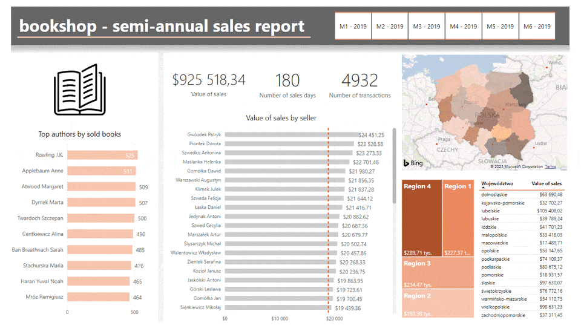
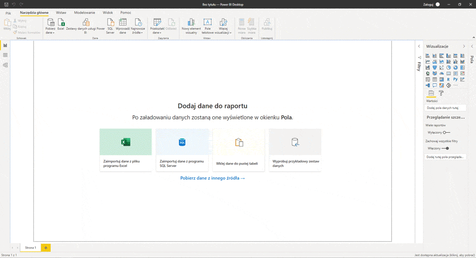
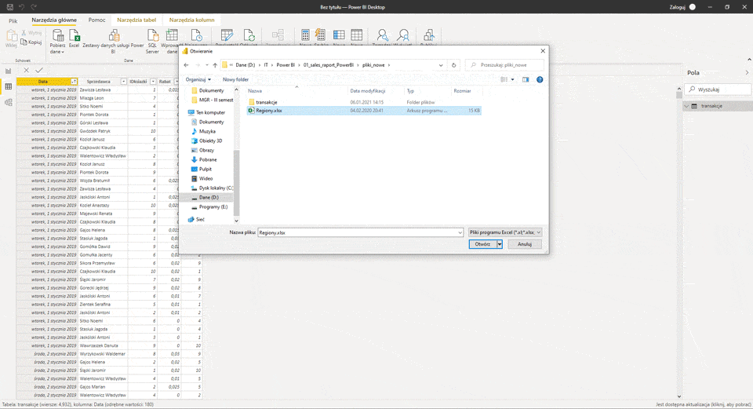
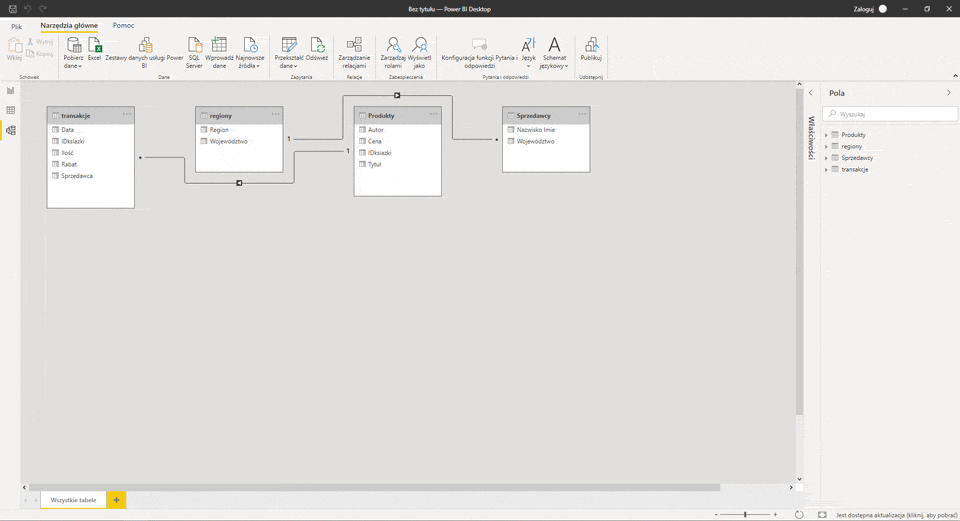
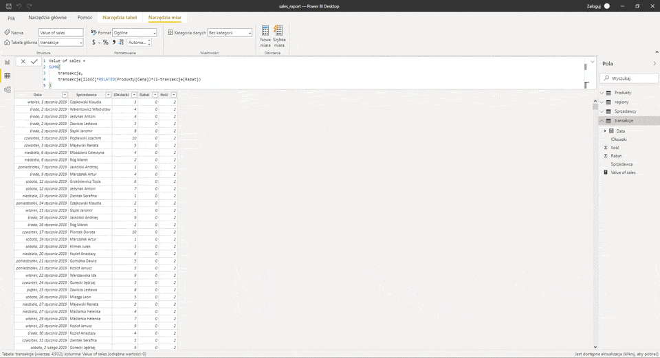
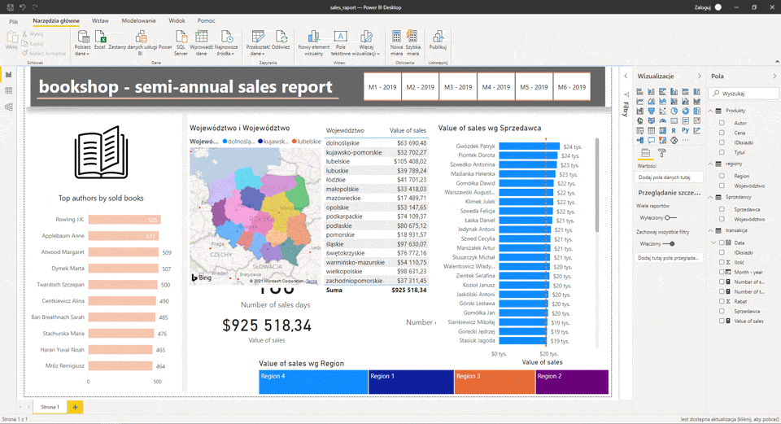

# About project
This is an example of an analytical report for a six-month bookstore sale. It was made using Microsoft PowerBI Desktop (visualization), PowerQuery (getting, transforming), PowerPivot (relations, connecting, model), DAX language and Excel. The data was randomly generated by the author. </br></br>

## Final file </br>


# Workflow </br>

## 1. Import and merge data </br>

Import Transactions in Excel format (6 files with data from 6 months of 2019). Link, Clean, and Transform with PowerQuery. Filtering duplicates. Import to PowerBI.




## 2. Join data </br>

Regions excel file added. Data transformation - change of headers. An additional 3 data tables have been added.



## 3. Add relations

Create relationships between tables. The data model has been created.



## 4. Add measures

Writing a measure Values of sales using the DAX language using function SUMX. Change the display of the format of a measure.
```
Value of sales =
   SUMX (
   transakcje,
   transakcje[Ilość]*RELATED(Produkty[Cena])*(1-transakcje[Rabat])
   )
```

Calculation of the number of all transactions in the first half of 2019 - creating a new measure.
```
Number of transactions =
COUNTROWS(transakcje)
```

Calculation of the number of sales days (counting unique results in the Date column).
```
Number of sales days = 
DISTINCTCOUNT(transakcje[Data])
```

Creating a monthly statement. Adding a new column specifying Month - Year in the Transactions table. Converting a date to text with the FORMAT function. This column used to filter the results in the main visualization as a slicer.
```
Month - year = 
   FORMAT (
     transakcje[Data], 
     "\MM - YYYY"
   )
```

Filtering data by province. Creating a map that is a filter using a choropleth map.
Display of data for individual regions. Table and tree map.
Display of sales for individual sellers. Average sales value added.
Adding a chart with best-selling book authors.



5. Final visualization
Graphic design - arrangement of elements and selection of colors.


